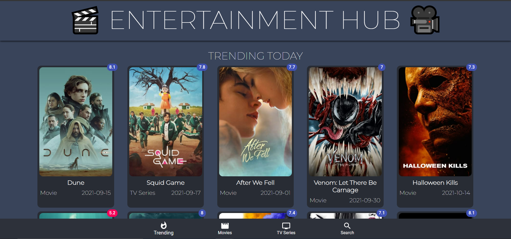
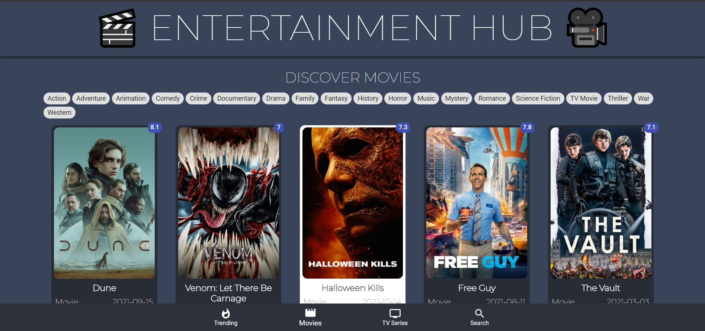
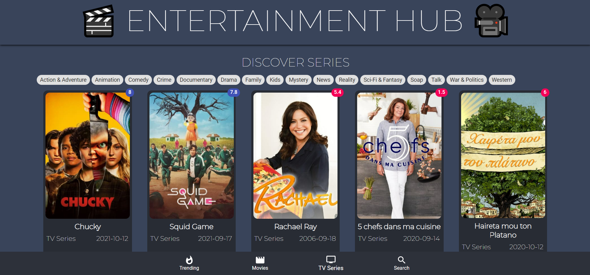
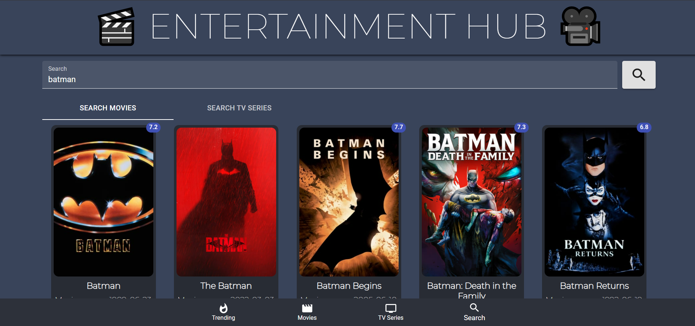

# Entertainment Hub

## Table of contents

- [General ](#general-info)
- [Tools and Technologies used](#tools-and-technologies-used)
- [Features](#features)

## General Info

> This is a web app that shows trending and category wise Movies and TV Series lists along with ability to search. •

> Designed and developed using HTML, CSS, React.js, React-router and hosted on Firebase. Used TMDB-API to fetch movies and TV Series list.

## Tools and Technologies used

1. <b>React.js </b> :- For giving a user friendly frontend.
2. <b> Material-UI </b> :- For icons and images
3. <b> Firebase </b> :- For hosting
4. <b> React-Routers </b> :- For switching between different chats without reloading the page

## Features

### Trending Movies:-
 

### Movies displayed category wise:-
 

### Series displayed category wise:-
 

### Search
 

